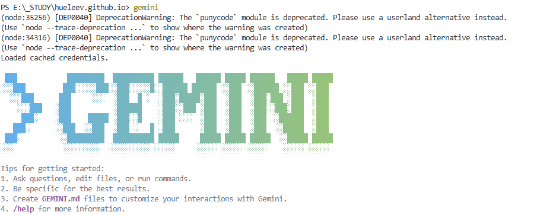
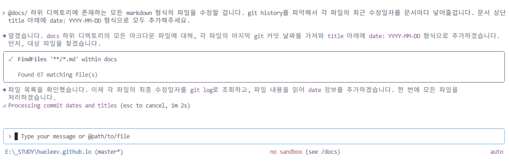

# 251117. 몇 년 사이에 많이 바뀌었다. (MCP, LLM,,,, 내 직업을 앗아갈 거 같은 것들)

개발 블로그를 방치한 지 오래..

그 사이에 많은 것들을 공부하였지만, 노션에다가 대충 정리하다보니 이 블로그는 완전히 방치돼있었다.

이대로 두다가는 정말 그대로 사라질 거 같아서 이제는 여기다가 뭐라도 정리하고.. 공부도 다시 시작 ..
*(사실은 시키는대로만 일하고 싶기도 하다.)*

---

내가 블로그를 방치한 사이에 LLM, MCP 이런 것들이 화두를 이루고 있는 데, 어쩌면 정말 내 직업이 생각보다 빨리 사라질 거 같기도 하다는 생각이 들었다.

회사에서도 정말 많은 변화가 있었고..

이제는 코딩을 내가 하는 거 보다 `geminiCLI`, `claudeCode`가 더 많이 하고 있는 거 같다는 점 ..

2년? 전만 해도 하나의 스택을 깊게 파는게 맞는가 넓게 아는 게 맞는가 고민을 회사에서 다같이 많이 했는데, 이제는 정말 넓게 아는 자가 승리한다는 확신이 든다. 어차피 모두에겐 개인 비서가 있으니까.

---

다시 블로그를 정비하면서 적용한 [목차🍀](/contents.html)

거의 90% geminiCLI에게 구현을 부탁했다.

이 블로그를 다시 제대로 채워보도록 하겠다.

