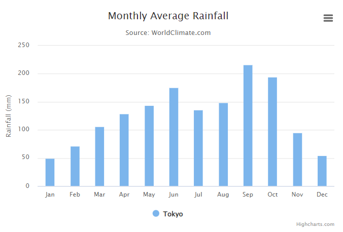
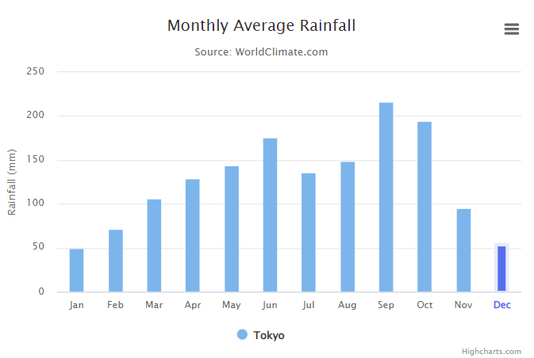
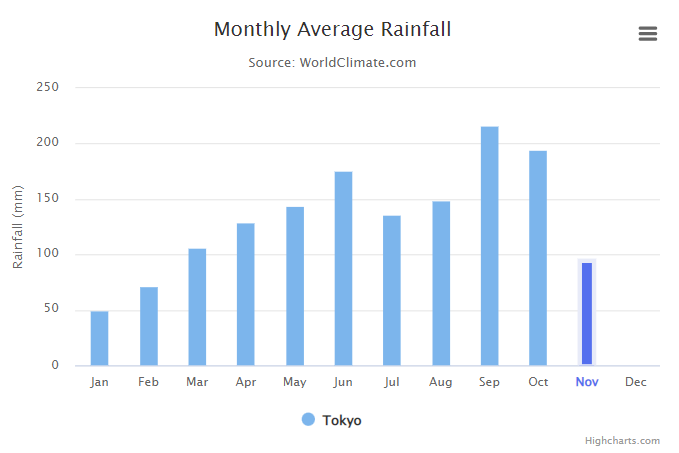

# 01. 하이차트(HighcCharts) 마지막 컬럼 색상 변경 / 항목 색상 변경

😶 **개발 하면서 최신값만 색상을 변경해야 하는 경우가 있었다. css로 해도 되나 여건 상 그렇게 작업을 해주시지 못하게 돼서 차트 옵션으로 해결해보았다.**

---

아래 이미지는 하이차트에 기본으로 있는 JSFiddle 예제이다.



아래와 같이 <u>최신값만 색상을 변경하고, border처리 하였다. label에도 파란색을 입혀줬다.</u>



label의 경우, null이나 0값 처리를 안하면 **formatter에서 isLast가 true일 경우에 update만 해줘도 된다.**

```jsx
xAxis: {
        categories: categories,
        crosshair: true,
        labels: {
        formatter: function() {
        	// xAxis labels 색상 변경 - 0 혹은 null 체크 안 할 경우
          if (this.isLast) {
            return `<b style="color: ${COLOR_BLUE}">${this.value}</b>`;
          } else {
            return this.value;
          }
        },
      },
  },
```

<br/>

나같은 경우에는 **null이나 0이 아닌 경우에만 색상을 변경**해야 해서 가장 마지막 data부터 1씩 빼줘가면서 해결했다. 코드는 하단에 chart events 부분을 보면 된다. 

(아래와 같이 마지막 데이터가 0인경우.. 아래 **코드** 클릭 시, JSFiddle로 이동된다.) 



## [코드](https://jsfiddle.net/rpqwnd5h/1/)


```jsx
const COLOR_BLUE = '#546fee';
const COLOR_SKY = '#e8ebf8'
const categories = [
            'Jan',
            'Feb',
            'Mar',
            'Apr',
            'May',
            'Jun',
            'Jul',
            'Aug',
            'Sep',
            'Oct',
            'Nov',
            'Dec'
        ]; 
        
Highcharts.chart('container', {
    chart: {
        type: 'column',
        events: {
            load: function() {
              let chart = this,
                data = chart.series[0].data;

              // 가장 최근 데이터 색상 변경
              let length = chart.series[0].data.length,
                idx = 1;
              while (idx <= length) {
                if (!data[length - idx].isNull && data[length - idx].y != 0) {
                  // column 색상 변경
                  data[length - idx].update({
                    color: COLOR_BLUE,
                    borderColor: COLOR_SKY,
                    borderWidth: 4,
                    pointWidth: 13,
                  });
                  // xAxis labels 색상 변경 - 0 혹은 null 체크 할 경우
                    chart.xAxis[0].update({
                      labels: {
                        formatter: function() {
                          if (data[length-idx].x == this.pos) {
                            return `<b style="color: ${COLOR_BLUE}">${this.value}</b>`;
                          } else {
                            return this.value;
                          }
                        },
                      },
                    });
                  break;
                } else {
                  idx++;
                }
              }
            },
          },
    },
    title: {
        text: 'Monthly Average Rainfall'
    },
    subtitle: {
        text: 'Source: WorldClimate.com'
    },
    xAxis: {
        categories: categories,
        crosshair: true,
        labels: {
          formatter: function() {
          	// xAxis labels 색상 변경 - 0 혹은 null 체크 안 할 경우
            if (this.isLast) {
              return `<b style="color: ${COLOR_BLUE}">${this.value}</b>`;
            } else {
              return this.value;
            }
          },
        },
    },
    yAxis: {
        min: 0,
        title: {
            text: 'Rainfall (mm)'
        }
    },
    tooltip: {
        headerFormat: '<span style="font-size:10px">{point.key}</span><table>',
        pointFormat: '<tr><td style="color:{series.color};padding:0">{series.name}: </td>' +
            '<td style="padding:0"><b>{point.y:.1f} mm</b></td></tr>',
        footerFormat: '</table>',
        shared: true,
        useHTML: true
    },
    plotOptions: {
        column: {
            pointPadding: 0.2,
            borderWidth: 0
        }
    },
    series: [{
        name: 'Tokyo',
        data: [49.9, 71.5, 106.4, 129.2, 144.0, 176.0, 135.6, 148.5, 216.4, 194.1, 95.6, 0]

    }]
});
```

### Reference

---

[HighCharts](https://api.highcharts.com/highcharts/)