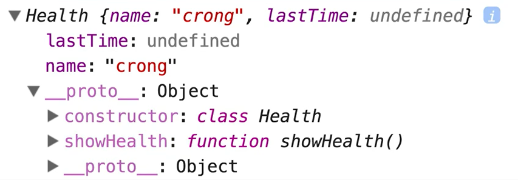

# 15. JavaScript CLASS ! 

😝 **원래 JavaScript에는 클래스가 따로 존재하지 않는데, ES6부터 클래스가 생겼다!**

## ✨ 일반적인 function

```jsx
function Health(name) {
  this.name = name;
}

Health.prototype.showHealth = function() {
  console.log(this.name + "님, 안녕하세요");
}

const h = new Health("damoo");
h.showHealth();
```

### 🔎 console

---

```basic
"damoo님, 안녕하세요"
```

## ✨ class

모습만 class 이지, `prototype`으로 구현된다.

```jsx
class Health {
  constructor(name, lastTime) {
    this.name = name;
    this.lastTime = lastTime;
  }
  
  showHealth() {
    console.log("안녕하세요, " + this.name + "님");
  }
}

const myHealth = new Health("damoo");
myHealth.showHealth();
console.log(toString.call(Health));
```

### 🔎 console

---

```basic
"안녕하세요, damoo님"
"[object Function]"
```



### Reference

---

[https://www.inflearn.com/course/es6-강좌-자바스크립트/dashboard](https://www.inflearn.com/course/es6-%EA%B0%95%EC%A2%8C-%EC%9E%90%EB%B0%94%EC%8A%A4%ED%81%AC%EB%A6%BD%ED%8A%B8/dashboard)

[https://jsbin.com/](https://jsbin.com/)