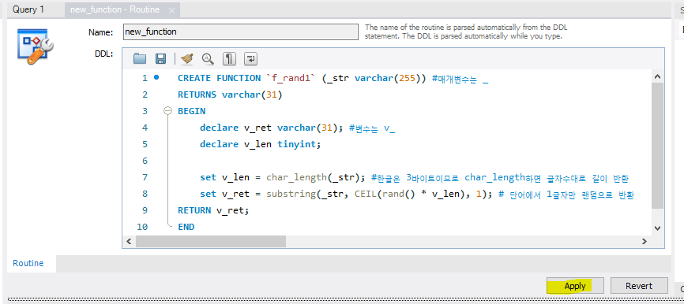

# 🎈 @시코 - MySQL 제대로 배우기 (inflearn)

우선 `mysql` 8버전을 [설치](https://www.mysql.com/)해주고, 설치 과정에서 `custom` 을 선택하여 `workbench`까지 8버전으로 설치해준다.

## Mysql 사용자

### mysql 접속

```sql
C:\Users\관리자>mysql -u root -p
Enter password: ************
Welcome to the MySQL monitor.  Commands end with ; or \g.
Your MySQL connection id is 34
Server version: 8.0.29 MySQL Community Server - GPL

Copyright (c) 2000, 2022, Oracle and/or its affiliates.
```

### 사용자 조회

```sql
mysql> use mysql;
Database changed
mysql> select user, host from user;
+------------------+-----------+
| user             | host      |
+------------------+-----------+
| mysql.infoschema | localhost |
| mysql.session    | localhost |
| mysql.sys        | localhost |
| root             | localhost |
+------------------+-----------+
4 rows in set (0.00 sec)
```

### 사용자 추가/권한부여

<b>create user</b>
`mysql> create user <user-name>@'<host>' identified by '<password>';`

```sql
mysql> create user 'test1234'@'localhost' identified by 'test1234';
Query OK, 0 rows affected (0.00 sec)

mysql> grant all privileges on test_database.* to test@'localhost';
Query OK, 0 rows affected (0.00 sec)
```

<b>grant</b>

```sql
mysql> grant all privileges on test_database.* to test_grant@'localhost' identified by 'test1234';
Query OK, 0 rows affected (0.00 sec)
```

<b>`localhost`대신에 `%`를 사용할 경우 외부에서도 접속 가능하다</b>

```sql
mysql> grant all privileges on test_database.* to test_grant@'%' identified by 'test1234';
Query OK, 0 rows affected (0.01 sec)
```

<b><u>적용하기 필수 !</u></b>

```sql
mysql> flush privileges;
```

### 비밀번호 변경

```sql
mysql> use mysql;
Database changed
mysql> update user set password=PASSWORD('변경할 비밀번호') where user='사용자이름';
Query OK, 1 row affected (0.00 sec)
Rows matched: 1  Changed: 1  Warnings: 0

mysql> flush privileges;
Query OK, 0 rows affected (0.00 sec)
```

### 사용자 삭제 

```sql
mysql> delete from user where user='USER_ID'; 
mysql> flush privileges;
mysql> delete from user where user='test';
Query OK, 1 row affected (0.00 sec)

mysql> delete from user where user='test_grant';
Query OK, 2 rows affected (0.00 sec)

mysql> flush privileges;
Query OK, 0 rows affected (0.00 sec)
```

## database 생성

```sql
mysql> show databases;
+--------------------+
| Database           |
+--------------------+
| information_schema |
| mysql              |
| performance_schema |
| sys                |
+--------------------+
4 rows in set (0.00 sec)

mysql> create database testdb;
Query OK, 1 row affected (0.02 sec)

mysql> show databases;
+--------------------+
| Database           |
+--------------------+
| information_schema |
| mysql              |
| performance_schema |
| sys                |
| testdb             |
+--------------------+
5 rows in set (0.00 sec)
```

## mysql workbench 연결


## table 생성

```sql
#부서
create table Dept(
	id tinyint unsigned not null auto_increment,
    pid tinyint unsigned not null default 0 comment '상위부서id',
    dname varchar(31) not null,
    PRIMARY KEY(id)
);

#직원
create table Emp(
	id int unsigned not null auto_increment,
    ename varchar(31) not null,
    dept tinyint unsigned not null,
    salary int not null default 0 ,
    primary key(id),
    foreign key(dept) references Dept(id)
);
```

<b>`workbench`에서 `refresh`해줘야 생성된 테이블 조회 가능</b>


::: tip unsigned
모든 Integer타입들은 `UNSIGNED`를 가지고 있다.

해당 컬럼이 <b>음수가 절대 될 일이 없는 경우,</b> (auto-increment로 primary key를 잡을 때와 같이) 수의 범위가 양수 쪽으로 더 넓으면 좋을 것이다.
이때 사용하는 게 `unsigned`타입이다.

* `unsigned` 아닐 때: `-2147483648 ~ 2147483647`
* `unsigned` 일 때:  `0 ~ 4294967295`
:::

## select/insert

```sql
#상위부서
insert into Dept(pid, dname) values (0, '영업부'), (0, '개발부');

#하위부서
insert into Dept(pid, dname) 
values (1, '영업1팀'), (1, '영업2팀'), (1, '영업3팀'), (2, '서버팀'), (2, '클라이언트팀');
```

## inner join

### 전체조회

```sql
mysql> select * from Dept;
+----+-----+--------------+
| id | pid | dname        |
+----+-----+--------------+
|  1 |   0 | 영업부       |
|  2 |   0 | 개발부       |
|  3 |   1 | 영업1팀      |
|  4 |   1 | 영업2팀      |
|  5 |   1 | 영업3팀      |
|  6 |   2 | 서버팀       |
|  7 |   2 | 클라이언트팀 |
+----+-----+--------------+
7 rows in set (0.00 sec)
```

### 하위 부서 조회

```sql
mysql> select d1.dname as '상위부서', d2.* from Dept d1 inner join Dept d2 on d1.id = d2.pid;
+----------+----+-----+--------------+
| 상위부서 | id | pid | dname        |
+----------+----+-----+--------------+
| 영업부   |  3 |   1 | 영업1팀      |
| 영업부   |  4 |   1 | 영업2팀      |
| 영업부   |  5 |   1 | 영업3팀      |
| 개발부   |  6 |   2 | 서버팀       |
| 개발부   |  7 |   2 | 클라이언트팀 |
+----------+----+-----+--------------+
5 rows in set (0.00 sec)
```

::: tip rand()
* 0과 1 사이의 난수 발생 

```sql
mysql> select rand();
+--------------------+
| rand()             |
+--------------------+
| 0.3301079471875987 |
+--------------------+
1 row in set (0.00 sec)
```

* 0~10 사이의 난수 하여 올림처리 (0이 나오지 않게 올림으로 처리)

```sql
mysql> select CEIL(rand() * 10);
+-------------------+
| CEIL(rand() * 10) |
+-------------------+
|                 3 |
+-------------------+
1 row in set (0.00 sec)
```
:::


## function 생성




### 1. 한글자를 랜덤으로 반환하는 함수를 만들어보자.

```sql
CREATE FUNCTION `f_rand1` (_str varchar(255)) -- 매개변수는 _
RETURNS varchar(31)
BEGIN
	declare v_ret varchar(31); -- 변수는 v_
    declare v_len tinyint;
    
    set v_len = char_length(_str); -- 한글은 3바이트이므로 char_length하면 글자수대로 길이 반환
    set v_ret = substring(_str, CEIL(rand() * v_len), 1); -- 단어에서 1글자만 랜덤으로 반환
RETURN v_ret;
END
```

```sql
mysql> select f_rand1('김이박');
+-------------------+
| f_rand1('김이박') |
+-------------------+
| 김                |
+-------------------+
1 row in set (0.00 sec)

mysql> select f_rand1('1234567');
+--------------------+
| f_rand1('1234567') |
+--------------------+
| 7                  |
+--------------------+
1 row in set (0.00 sec)

mysql> select f_rand1('1234567');
+--------------------+
| f_rand1('1234567') |
+--------------------+
| 3                  |
+--------------------+
1 row in set (0.00 sec)
```

### 2. `f_rand1`함수를 활용해서 이름을 만들어주는 함수를 만들어보자.

```sql
CREATE FUNCTION `f_randname` ()
RETURNS varchar(31)
BEGIN
	declare v_ret varchar(31);
    declare v_lasts varchar(255) default '김이박조최전천방지마유배원'; -- 성
    declare v_firsts varchar(255) default '순신세종성호지혜가은세호민국가나다라마바사아자차결찬'; -- 이름
    
    set v_ret = concat(f_rand1(v_lasts), f_rand1(v_firsts), f_rand1(v_firsts));
RETURN v_ret;
END
```

```sql
mysql> select f_randname();
+--------------+
| f_randname() |
+--------------+
| 유결은       |
+--------------+
1 row in set (0.00 sec)

mysql> select f_randname();
+--------------+
| f_randname() |
+--------------+
| 원다호       |
+--------------+
1 row in set (0.00 sec)
```

## Procedure

### 여러명의 직원을 프로시저로 넣어보자.


하위부서에 속하기 위해
```sql
CREATE PROCEDURE `sp_test_emp` (_cnt int)
BEGIN
	declare v_idx int default 0;
    while v_idx < _cnt
    do
        -- 하위부서에 속하기 위에 '34567', 급여는 *100하여 `100~900`까지
		insert into Emp(ename, dept, salary) values (f_randname(), f_rand1('34567'), f_rand1('123456789') * 100);        
        set v_idx = v_idx + 1;
    end while;
END
```

```sql
mysql> call sp_test_emp(10);
Query OK, 1 row affected (0.02 sec)

mysql> select * from emp;
+----+--------+------+--------+
| id | ename  | dept | salary |
+----+--------+------+--------+
|  1 | 전차종 |    7 |    100 |
|  2 | 마민종 |    4 |    800 |
|  3 | 조자라 |    6 |    500 |
|  4 | 최호순 |    5 |    400 |
|  5 | 조세호 |    6 |    200 |
|  6 | 최국세 |    5 |    200 |
|  7 | 조차마 |    7 |    500 |
|  8 | 방세지 |    3 |    700 |
|  9 | 전결은 |    3 |    100 |
| 10 | 이세사 |    6 |    800 |
| 11 | 천바가 |    5 |    300 |
| 12 | 유혜종 |    6 |    400 |
+----+--------+------+--------+
12 rows in set (0.00 sec)
```

## group by

### 부서별 직원 수 조회

```sql
mysql> select dept, count(*) from Emp group by dept;
+------+----------+
| dept | count(*) |
+------+----------+
|    3 |       62 |
|    4 |       47 |
|    5 |       47 |
|    6 |       55 |
|    7 |       51 |
+------+----------+
5 rows in set (0.00 sec)
```

## table 정보

```sql
mysql> desc Dept;
+-------+------------------+------+-----+---------+----------------+
| Field | Type             | Null | Key | Default | Extra          |
+-------+------------------+------+-----+---------+----------------+
| id    | tinyint unsigned | NO   | PRI | NULL    | auto_increment |
| pid   | tinyint unsigned | NO   |     | 0       |                |
| dname | varchar(31)      | NO   |     | NULL    |                |
+-------+------------------+------+-----+---------+----------------+
3 rows in set (0.00 sec)
```
```sql
mysql> show create table Dept;
+-------+-------------------------------------------------------------------------------------------------------------------------------------------------------------------------------------------------------------------------------------------------------------------------------------+
| Table | Create Table                                                                                                                                                                                                                                                                        |
+-------+-------------------------------------------------------------------------------------------------------------------------------------------------------------------------------------------------------------------------------------------------------------------------------------+
| Dept  | CREATE TABLE `dept` (
  `id` tinyint unsigned NOT NULL AUTO_INCREMENT,
  `pid` tinyint unsigned NOT NULL DEFAULT '0' COMMENT '상위부서id',
  `dname` varchar(31) NOT NULL,
  PRIMARY KEY (`id`)
) ENGINE=InnoDB AUTO_INCREMENT=8 DEFAULT CHARSET=utf8mb4 COLLATE=utf8mb4_0900_ai_ci |
+-------+-------------------------------------------------------------------------------------------------------------------------------------------------------------------------------------------------------------------------------------------------------------------------------------+
1 row in set (0.00 sec)
```

```sql
mysql> show index from Dept;
+-------+------------+----------+--------------+-------------+-----------+-------------+----------+--------+------+------------+---------+---------------+---------+------------+
| Table | Non_unique | Key_name | Seq_in_index | Column_name | Collation | Cardinality | Sub_part | Packed | Null | Index_type | Comment | Index_comment | Visible | Expression |
+-------+------------+----------+--------------+-------------+-----------+-------------+----------+--------+------+------------+---------+---------------+---------+------------+
| dept  |          0 | PRIMARY  |            1 | id          | A         |           0 |     NULL |   NULL |      | BTREE      |         |               | YES     | NULL       |
+-------+------------+----------+--------------+-------------+-----------+-------------+----------+--------+------+------------+---------+---------------+---------+------------+
1 row in set (0.00 sec)

mysql> show index from Emp;
+-------+------------+----------+--------------+-------------+-----------+-------------+----------+--------+------+------------+---------+---------------+---------+------------+
| Table | Non_unique | Key_name | Seq_in_index | Column_name | Collation | Cardinality | Sub_part | Packed | Null | Index_type | Comment | Index_comment | Visible | Expression |
+-------+------------+----------+--------------+-------------+-----------+-------------+----------+--------+------+------------+---------+---------------+---------+------------+
| emp   |          0 | PRIMARY  |            1 | id          | A         |           0 |     NULL |   NULL |      | BTREE      |         |               | YES     | NULL       |
| emp   |          1 | dept     |            1 | dept        | A         |           0 |     NULL |   NULL |      | BTREE      |         |               | YES     | NULL       |
+-------+------------+----------+--------------+-------------+-----------+-------------+----------+--------+------+------------+---------+---------------+---------+------------+
2 rows in set (0.00 sec)
```

## table 복제

### 데이터빼고 구조만 복제

```sql
create table Dept2 like Dpet;
```

### 데이터까지 복제

```sql
create table Dept3 AS select * from Dept;
```

:::  danger
<b>index</b>는 설정되지 않는다..!
foriegn key와 같은 설정은 복제되지 않으므로 따로 설정해주어야 함.
:::

## table 수정

```sql
-- on update: 데이터 수정됐을때 current_timestamp 업데이트
alter table Dept add column workdate timestamp not null default current_timestamp on update current_timestamp;
```

```sql
mysql> select * from Dept;
+----+-----+---------+---------------------+
| id | pid | dname   | workdate            |
+----+-----+---------+---------------------+
|  1 |   0 | 영업부  | 2022-04-27 14:17:46 |
|  2 |   0 | 개발부  | 2022-04-27 14:17:46 |
|  3 |   1 | 영업1팀 | 2022-04-27 14:17:46 |
|  4 |   1 | 영업2팀 | 2022-04-27 14:17:46 |
|  5 |   1 | 영업3팀 | 2022-04-27 14:17:46 |
|  6 |   2 | 서버팀  | 2022-04-27 14:17:46 |
|  7 |   2 | 클라팀  | 2022-04-27 14:18:06 |
+----+-----+---------+---------------------+
7 rows in set (0.00 sec)
```

### 아래와 같이 block처리해서 수정하는 연습하기 

```sql
select * from Dept
-- update Dept set dname='클라팀'
where id = 7;
```

### truncate 과 delete 차이

`truncate`은 테이블을 지웠다가 다시 생성하는 거나 다름 없다. auto_increment가 1부터 다시 시작한다.

`delete`해서 모든 데이터를 지우면 auto_increment가 이전 값에서 +1 된다.

## TCL: Commit & Rollback

::: danger
Session 단위로 Tx는 제어됨.
:::

### autocommit 확인

```sql
select @@autocommit;
-- 변경하는 방법 SET AUTOCOMMIT = FALSE; 
```

### 여러가지 작업을 할 때, 불안한 경우 `transcation`으로 작업해준다.

```sql
start transaction; -- transaction 시작
select * from Dept where id in (1,2);
update Dept set dname='영업111' where id = 1;
commit; -- 적용하고픈 경우,
rollback; -- 취소하고픈 경우,
```

### savepoint

```sql
start transaction; -- transaction 시작

savepoint sp1; -- savepoint1 시작
update Dept set dname='영업111' where id = 1;

savepoint sp2; -- savepoint2 시작
update Dept set dname='개발111' where id = 2;

rollback to savepoint sp2; --sp2 만 롤백

commit; -- 적용 (sp1만 적용됨)
```

## Reference

[inflearn_@시코 - MySQL 제대로 배우기](https://www.inflearn.com/course/mysql-%EC%A0%9C%EB%8C%80%EB%A1%9C/)
[mysql 사용자](https://technote.kr/32)