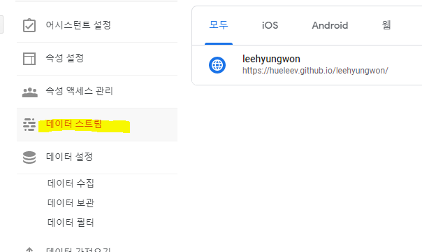
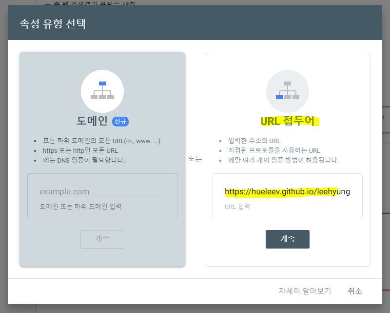
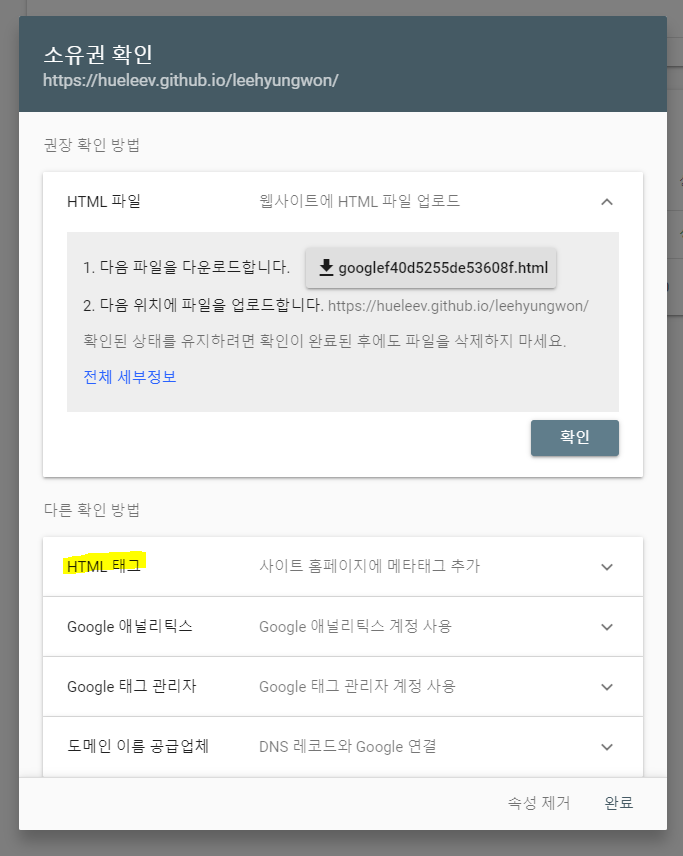
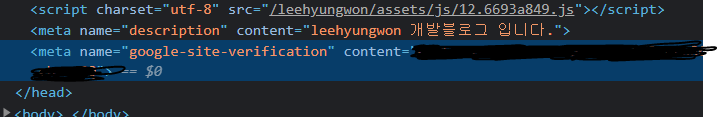
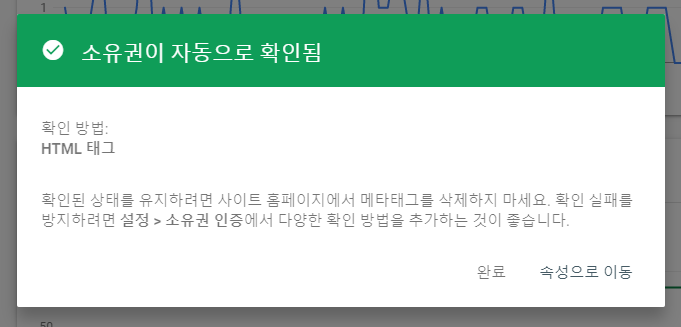

# 05. 검색엔진 SEO 최적화

💖 **키워드를 검색하면 내 블로그가 뜰 수 있게 얼른 SEO랑 댓글 기능을 적용해야겠다!**

## Sitemap

`Sitemap.xml` 은 검색 엔진 크롤링 로봇에게 크롤링해야 할 URL을 전달한다.

이 파일이 해당 사이트의 URL 전부를 xml 파일 형식으로 포함한다. 사이트맵은 검색 엔진에 URL을 추가 혹은 배제함으로서 `robots.txt` 파일을 보완하는 역할을 한다.

:::warning

**사이트맵 제출이 색인을 보장하는 것은 아니다.**

검색엔진이 크롤링하여 페이지 URL을 발견하는 메커니즘을 보완하는 의미일 뿐, 사이트맵이 크롤링을 완전히 대체하는 것은 아니다. 모두 색인해준다는 보증이 있는 것은 아니라는 것을 꼭 기억하자.

:::

<br/>

📌 **설치, vsc 터미널에 아래 코드를 입력**

```bash
npm install -D vuepress-plugin-sitemap
```

<br/>

📌 **사용, hostname 에 블로그 url을 넣어준다.**
:::tip
💎 **아무리 해도 sitemap.xml이 생기지 않아 dateFormatter를 넣어주었더니 빌드 성공!** 
<br/>
💎 **그리고 plugins에서 가장 위에 써줘야 경로를 제대로 확인할 수 있었다...ㅠㅠ**
<br/>
>**이거때문에 계속 에러남.. 뭔가 다른 플러그인이랑 꼬이는거 같다**
<br/>

💎 **배포 후, {blog_url}/sitemap.xml이 잘 뜨는지 확인필수 !**
:::
```bash
// .vuepress/config.js
module.export = {
  plugins: [
    ["sitemap",
      {
        hostname: "https://hueleev.github.io/leedamoo",
        dateFormatter: val => {  // 이부분을 넣어줬더니 빌드가 제대로 됐다.
          return new Date().toISOString()
        }
      }
    ]
  ]
};
```

<br/>

📌 **배포 이후, 구글 서치 콘솔에 가서 sitemap 제출란에 `https://hueleev.github.io/{REPO}/sitemap.xml` 로 등록하면 된다.**

## Robots.txt

`Robots.txt`는 크롤링 로봇이 웹에 접글할 때, 로봇이 지켜야하는 규칙과 사이트맵 파일의 위치를 알려주는 역할을 하는 파일이다. 

파일의 위치가 매우 중요하다. 꼭, **`vuepress/public/robots.txt`** 에 위치하도록 한다.

```jsx
User-agent: *
Allow: /
Sitemap: https://hueleev.github.io/{REPO}/sitemap.xml
```

## Google Analytics (구글 애널리틱스)

📌 [https://analytics.google.com/](https://analytics.google.com/) 

**속성을 생성해준 후, 데이터 스트림을 클릭한다.**



<br/>

📌 **하단에 태그 사용을 참조하여,  `config.js` 에 아래와 같이 입력해주면 끝!**

```jsx
// config.js
head: [
      ['script', { async: true, src: 'https://www.googletagmanager.com/gtag/js?id=G-XXXXX' }],
      [
        'script',
        {},
        `
        window.dataLayer = window.dataLayer || [];
        function gtag(){dataLayer.push(arguments);}
        gtag('js', new Date());

        gtag('config', 'G-XXXXXXX');
      `],
    ],
```

## meta

📌 **메타 태그만 잘 관리하여도 유리하다고 하여 이것도 한번 적용해보겠다.**

```basic
<html lang="en-US">
  ...
  <title>{게시물 타이틀} | {블로그 title}</title>
  <meta name="description" content="{블로그 description}">
  ...
```

<br/>

블로그 `title`과 `description`은 `config.js`에서 수정할 수 있다.

또한 모든 페이지 `<head>`에 꼭 넣고 싶은게 있다면 아래와 같이 넣어주면 된다.

예를 들면, `구글 애드센스`를 활용하는 경우?

<br/>

```jsx
// .vuepress/config.js
module.exports = {
    title: "nowgnuyheel",
    description: "nowgnuyheel 개발블로그 입니다.",
    head: [
      ['script', { "data-ad-client": "ca-pub-XXXXX", async: true, src: 'https://pagead2.googlesyndication.com/pagead/js/adsbygoogle.js' }],
		]
}
```

<br/>

📌 **다음 모든 게시물에 아래와 같이 자세하게 `meta` 태그를 걸어주면 검색에 유리!**

```jsx
---
title: 검색엔진 SEO 최적화
lang: ko-KR
meta:
  - name: description
    content: SEO를 알아보고 VuePress에 적용하자.
  - name: keywords
    content: SEO 검색 엔진 최적화
---
```
<br/>

📌 **국가코드는 페이지별로 설정할 필요 없으니 `config.js` 에서 설정해주도록 하자.**

```jsx
// .vuepress/config.js
module.exports = {
  ...
  locales: {
    '/': { lang: 'ko-KR' }
  },
  ...
```

### tip, 구글 서치 콘솔

---

📌 **구글 서치 콘솔에 들어간다.** 

[https://search.google.com/search-console](https://search.google.com/search-console)

<br/>

📌 **속성을 추가 해준다.  본인의 github 블로그 url을 입력해준다.**



<br/>

📌 **서치콘솔에서 HTML 태그를 선택하여 meta태그를 블로그 첫 화면 `[README.md](http://readme.md)` 에 넣어주었다**



```markdown
// README.md 파일
---
meta:
    - name: google-site-verification
      content: 컨텐트 value
---
```

<br/>

📌 **배포 후, 사이트 메인에서 개발자도구를 열어 확인해주면,**



**위와 같이 메타 태그가 들어간 것을 확인할 수 있다 !**

<br/>

📌 **확인해주면, 아래와 같이 소유권이 확인된다.**



### Reference

---

[https://www.ascentkorea.com/what-is-robots-txt-sitemap-xml/](https://www.ascentkorea.com/what-is-robots-txt-sitemap-xml/)

[https://kyounghwan01.github.io/blog/Vue/vuepress/seo/#시작하기](https://kyounghwan01.github.io/blog/Vue/vuepress/seo/#%E1%84%89%E1%85%B5%E1%84%8C%E1%85%A1%E1%86%A8%E1%84%92%E1%85%A1%E1%84%80%E1%85%B5)