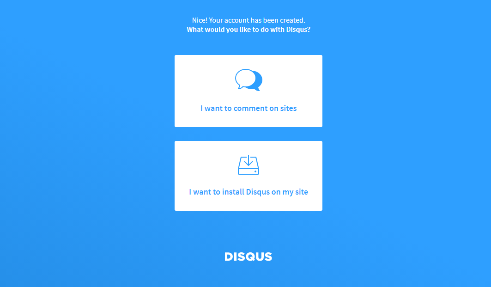
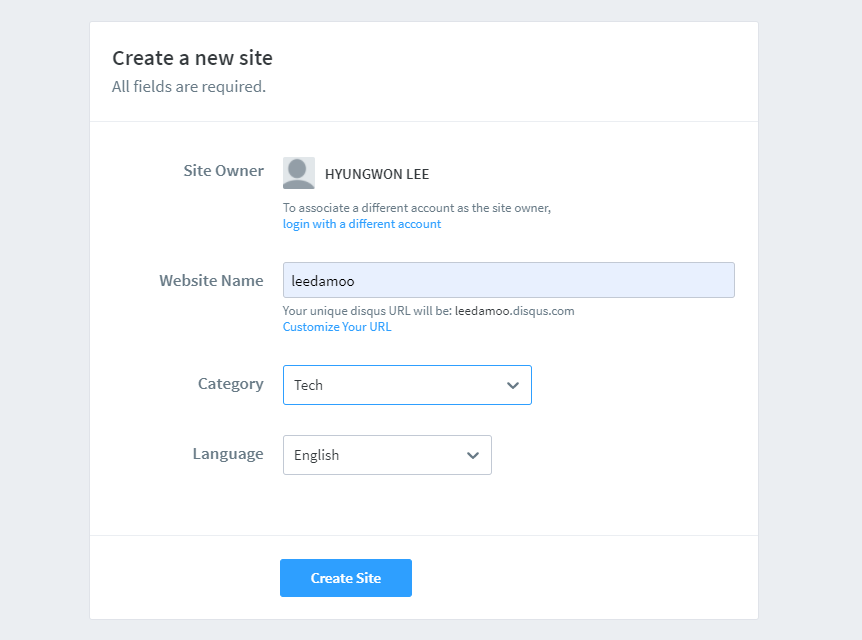
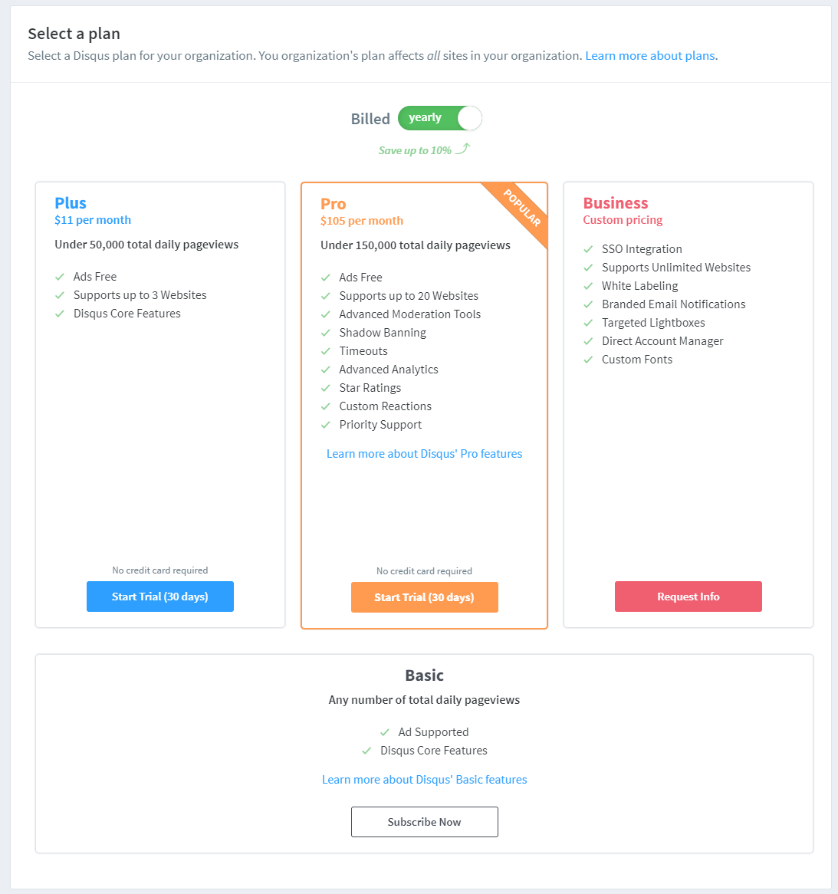
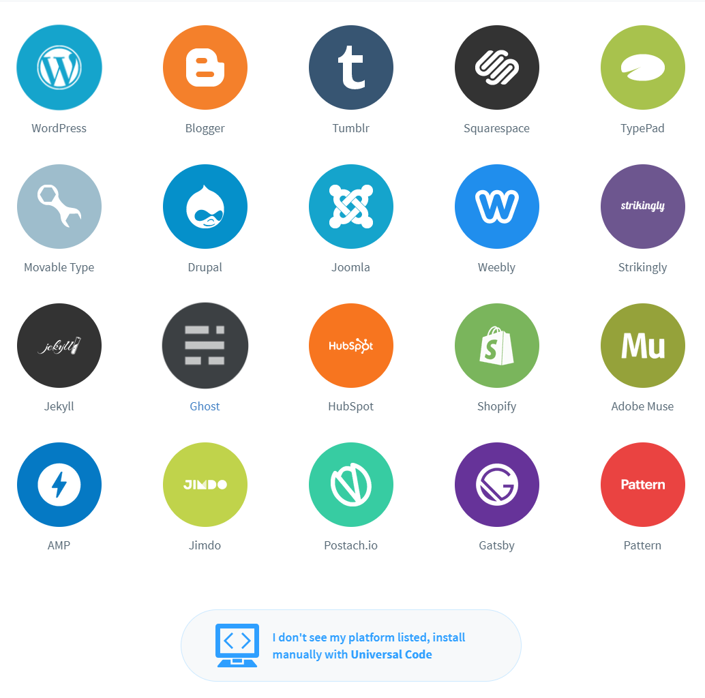
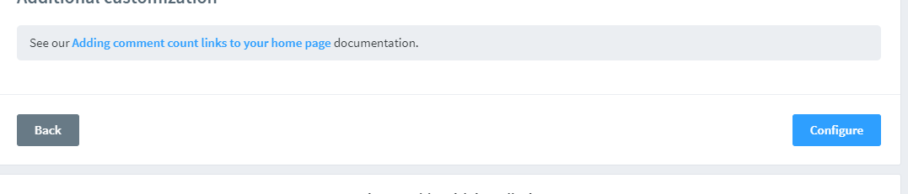
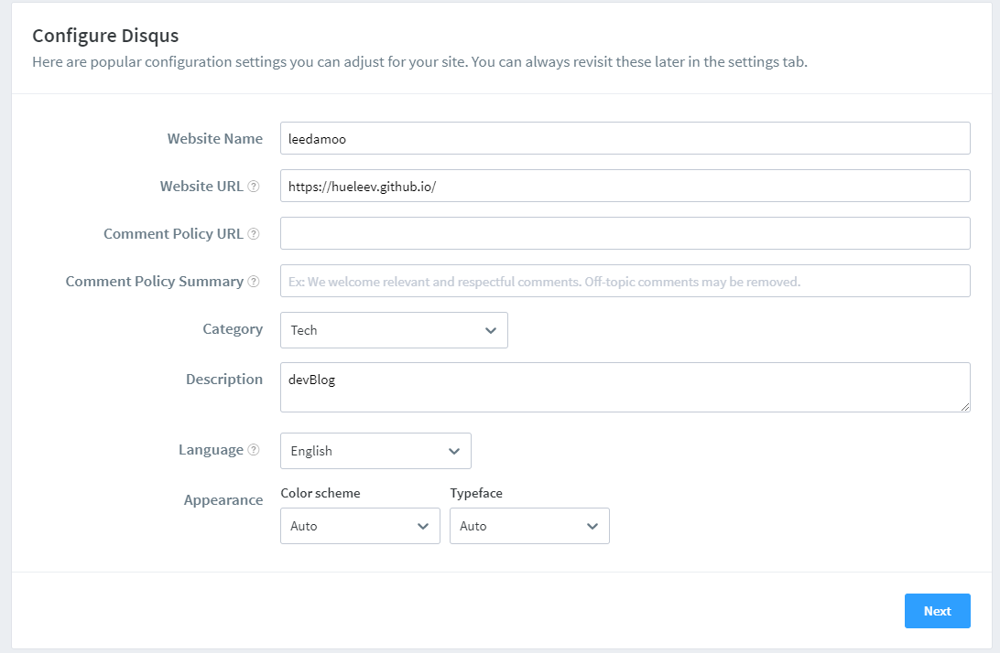

# 06. vuepress 댓글 적용하기 | DISQUS

🤗 **드디어 댓글 적용하기 ! 이것만 하면 거~의 완벽하게 vuepress 블로그 만들기 끄읕**

## Disqus 가입

📌 **먼저, [Disqus](https://disqus.com/) 사이트에 들어가 가입을 하고, 내 블로그 url을 등록해주자.**

**아래 `I want to install Disqus on my site` 를 클릭해준다!**

**혹시 아래 화면을 못찾겠다면 메인에 `Get Started` 를 눌러주면 된다.**



<br/>

📌 **그리고 아래와 같이 구분할 수 있는 `Website Name` 을 입력해주자!**



<br/>

📌 **그 다음, 아래 `Basic` 을 클릭 !**



<br/>

📌 **이때, 각자 맞는 플랫폼을 클릭해주면 되는데 나는 없어서 맨 아래 `I dont see..` 를 클릭했다.**

**그리고 다음 화면에서 맨 아래 `Configure`를 클릭해주자.**





<br/>

📌 **아래와 같이 `url`을 입력해주자.**



## Component 생성

📌 **`docs/.vuepress/components` 하단에 `disqus.vue` 파일을 아래와 같이 생성해준다.**

```jsx
<template>
  <div id="disqus_thread"></div>
</template>
<script>
export default {
    mounted() {
        var disqus_config = function () {
            this.page.url = window.location.origin;  
            this.page.identifier = window.location.pathname; 
        };
        (function() {
            var d = window.document, s = d.createElement('script');
            s.src = 'https://[웹사이트명].disqus.com/embed.js';
            s.setAttribute('data-timestamp', +new Date());
            (d.head || d.body).appendChild(s);
        })();
    }
}
</script>
```

<br/>

📌 **댓글 기능을 넣고 싶은 게시글 아래에 컴포넌트를 추가해준다.**

```jsx
// board.md
<Disqus />
```

## 모든 게시글에 댓글기능 쉽게 적용하기

📌 **하지만 언제 모든 게시글에 컴포넌트를 추가해주나.. 자동으로 등록되게 해보자.**

**먼저, `@vuepress/theme-default`를 설치한다.**

```bash
npm install -D @vuepress/theme-default
```

<br/>

📌 **다음, `.vuepress/theme/index.js` 아래와 같이 추가해준다.**

```jsx
// .vuepress/theme/index.ks
module.exports = {
  extend: "@vuepress/theme-default"
};
```

혹은

```jsx
plugins: [
      '@vuepress/theme-default',
]
```

<br/>

📌 **그리고 마지막으로 `.vuepress/theme/Layout.vue` 를 추가해거나....**

```jsx
<!-- .vuepress/theme/Layout.vue -->
<template>
  <ParentLayout>
    <Disqus slot="page-bottom" class="content" />
  </ParentLayout>
</template>

<style scoped>
.content {
    width: 750px;
    margin: 0 auto;
}
</style>

<script>
import ParentLayout from "@parent-theme/layouts/Layout.vue";
import Disqus from "../components/Disqus";

export default {
    components: {
        ParentLayout,
        Disqus
    }
};
</script>
```

<br/>

📌 **나는 기존에 eject 해온 theme 가 존재해서... `.vuepress/theme/layouts/Layout.vue` 에 `Disqus`를 추가해주었다.**

```jsx
// .vuepress/theme/layouts/Layout.vue
<Page
  v-else
  :sidebar-items="sidebarItems"
>
  <template #top>
    <slot name="page-top" />
  </template>
  <template #bottom>
    <slot name="page-bottom" />
	<Disqus class="content" />
  </template>
</Page>

<script>
import Disqus from '../components/Disqus' // 경로 확인을 꼭 하자 ! 난 Disqus 컴포넌트를 .vuepress/theme 하단으로 이동해주었다.

export default {
  components: {
    ...
    Disqus
  }
}
</script>

<style scoped>
.content {
width: 750px;
margin: 0 auto;
}
</style>
```

<br/>

📌 **또한 SPA 기반 블로그이므로 다른 페이지로 가도 `Disqus` 컴포넌트가 바뀌지 않는 문제점을 해결해야 한다.**

**나는 다른 블로그를 참조하여 아래와 같이 `router.afterEach` 코드를 추가하였다.**

```jsx
// .vuepress/theme/layouts/Layout.vue 
mounted() {
    this.$router.afterEach((to, from) => {
      if (from.path !== to.path) {
        if (typeof window !== 'undefined' && window.DISQUS) {
          setTimeout(() => {
            console.log('DISQUS is exists and try to load!')
            window.DISQUS.reset({ reload: true })
          }, 0)
        }
      }
      this.isSidebarOpen = false;
    })
}
```

### Reference

---

[https://kyounghwan01.github.io/blog/Vue/vuepress/vuepress-content/#개선](https://kyounghwan01.github.io/blog/Vue/vuepress/vuepress-content/#%E1%84%80%E1%85%A2%E1%84%89%E1%85%A5%E1%86%AB)
[https://62che.com/blog/vuepress/%EB%8C%93%EA%B8%80-%EC%8B%9C%EC%8A%A4%ED%85%9C-%EC%97%B0%EB%8F%99%ED%95%98%EA%B8%B0.html#%E1%84%92%E1%85%A2%E1%84%80%E1%85%A7%E1%86%AF%E1%84%8B%E1%85%B3%E1%86%AF-%E1%84%92%E1%85%A1%E1%84%8C%E1%85%A1](https://62che.com/blog/vuepress/%EB%8C%93%EA%B8%80-%EC%8B%9C%EC%8A%A4%ED%85%9C-%EC%97%B0%EB%8F%99%ED%95%98%EA%B8%B0.html#%E1%84%92%E1%85%A2%E1%84%80%E1%85%A7%E1%86%AF%E1%84%8B%E1%85%B3%E1%86%AF-%E1%84%92%E1%85%A1%E1%84%8C%E1%85%A1)